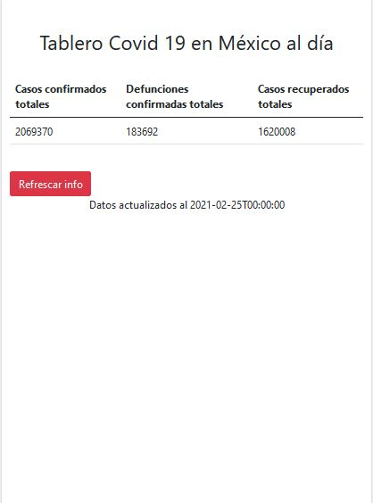
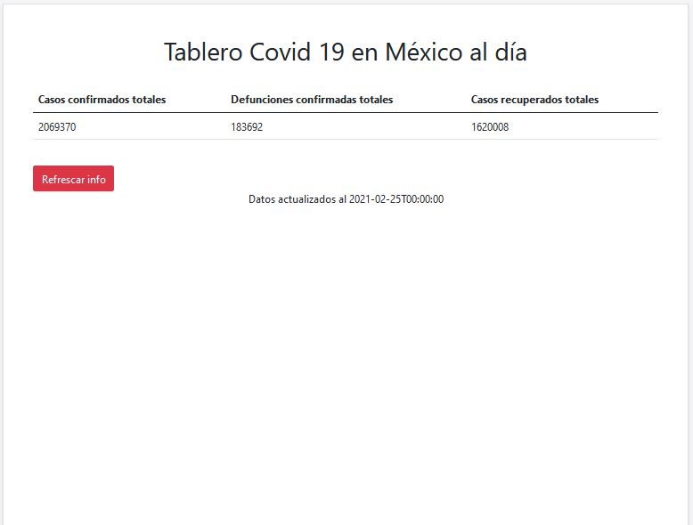

# Tablero de situación covid en tiempo real
Este proyecto frontend es un tablero de la situación covid en México, consume una API gratuita mediante fetch, además de implemetar Bootstrap CDN como framework.

## Instalación
Para correr el proyecto solo es necesario descargar o clonar el repositorio y abrir en el navegador el index.html

## Previsualización
###  __Previsualización en desktop__

### __Previsualización en celular__

### __Previsualización en tablet__

## Creditos
- API: Coronavirus Smartable [https://rapidapi.com/SmartableAI/api/coronavirus-smartable/]
- Guia: [https://www.youtube.com/watch?v=bXoNcBaxfVs]
